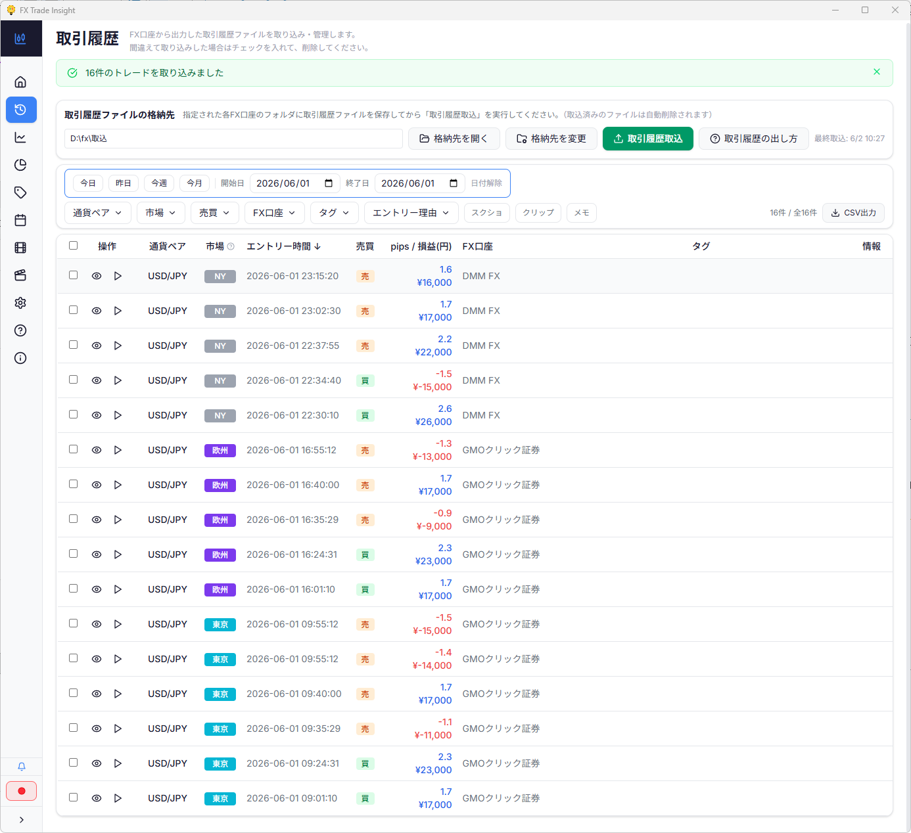
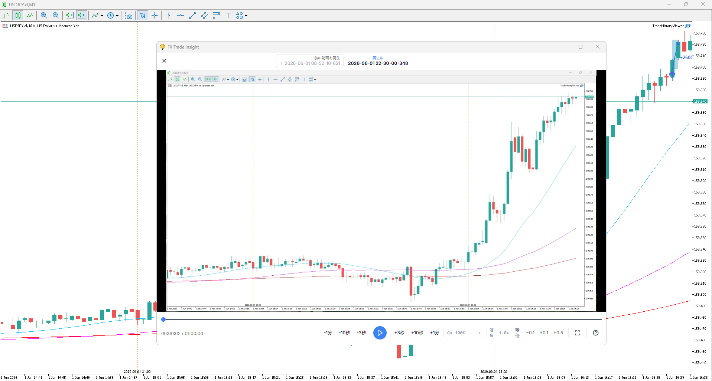
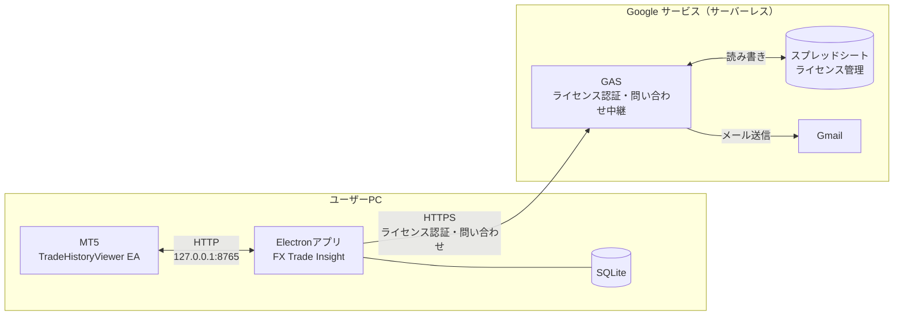

# FX Trade Insight

FXトレーダーの振り返りを効率化する Windows 向けデスクトップアプリ。
取引履歴・録画動画・MT5チャートをひとつにつなぎ、データドリブンな振り返りサイクルを実現します。


---

## デモ動画

<!-- デモ動画が用意できたら差し替え -->
> 準備中

---

## スクリーンショット

| 取引履歴一覧 | 録画動画をその場で再生 | 市場別成績 |
|---|---|---|
|  |  |  |

---

## 解決する課題

- 損切りしたけど、なぜエントリーしたのか覚えていない
- 録画はしているのに、見返す時間が取れない
- なんとなく勝ち負けしているが、パターンが見えない
- MT5とメモ帳を行ったり来たりする振り返りが面倒

---

## 主な機能

### 取引履歴の取込・管理
- 国内主要FX会社14社のCSVに対応（GMOクリック証券・DMM FX・楽天FX・外為どっとコム・FXTF・松井証券・外貨ex・ヒロセ通商・JFX・OANDA証券・LINE FX・みんなのFX・LIGHT FX・SBI FX）
- タグ・エントリー理由・メモの記録
- 取引履歴のフィルタ・ソート・CSVエクスポート

### MT5チャート連携
- 専用EA（MQL5）をMT5に適用するだけで取引履歴をチャート上に自動プロット
- 損益ラベルのクリックでその時刻の録画動画をワンクリック再生
- Shift+クリックで詳細入力画面を直接開く

### 動画管理
- アプリ内蔵のスケジュール録画（ffmpeg）。指定時刻に自動開始・終了
- 録画動画をエントリー時刻で自動検索して再生（何分何秒か探す手間なし）
- エントリー・決済時点のスクリーンショットを自動生成
- トレードのクリップ動画（エントリー前後のみ切り出し）を生成

### 成績分析
- 市場別成績（東京・欧州・NY）: 勝率・損益・ペイオフレシオ・期待値
- 期間別成績（日別・週別・月別比較）
- カレンダー成績（日ごとの損益カレンダー・SNS用画像生成）
- エントリー理由別成績（どの根拠で入ると勝率が高いか）

---

## システム構成



- **Electronアプリ ↔ MT5 EA**: PC内のHTTP API（127.0.0.1:8765）で通信。インターネット不要
- **Electronアプリ ↔ GAS**: ライセンス認証・お問い合わせ送信でHTTPS通信。バックグラウンド非同期で起動速度に影響なし

### ローカル API エンドポイント（MT5 EA 向け）

| エンドポイント | メソッド | 用途 |
|---|---|---|
| `/api/trades` | GET | 通貨ペア・期間でフィルタした取引履歴をJSON返却 |
| `/api/trade` | POST | MT5 EAからのトレードデータ保存 |
| `/api/video/find` | GET | エントリー時刻に対応する動画ファイルを検索 |
| `/api/open-video` | GET | 指定パス・再生位置で動画プレーヤーを起動 |
| `/api/open-trade` | GET | 取引履歴詳細を別ウィンドウで表示 |
| `/video-file` | GET | 動画ファイル配信（Rangeリクエスト対応） |

---

## 技術スタック

| 技術 | 採用理由 |
|---|---|
| **Electron** | Windows向けデスクトップアプリとして、Web技術でUIを構築しながらファイルシステムへのフルアクセスが必要だったため |
| **TypeScript + React** | Main/Rendererプロセス間の型安全性を保ちながら開発速度を確保するため |
| **better-sqlite3** | ローカルDBとしてインストール不要・同期APIで扱いやすく、トレード数万件規模でも十分な速度が出るため |
| **ffmpeg（ffmpeg-static）** | 動画録画・クリップ生成・スクリーンショット抽出をアプリ単体で完結させるため |
| **Tailwind CSS** | テーマカラー切り替え（ライト/ダーク）をCSS変数で実現しつつ、一貫したUIを効率よく構築するため |
| **GAS（Google Apps Script）** | ライセンス認証サーバーをインフラ費用ゼロ・サーバーレスで実現するため |
| **MQL5** | MT5 EAの開発言語。チャートへの描画・ラベルイベント・HTTP通信を担当 |

---

## 動作環境

- Windows 11（64bit）
- メモリ 8GB 以上推奨（録画使用時は 16GB 以上推奨）
- MT5（チャートプロット・EA機能を使う場合）

---

## 開発環境のセットアップ

```bash
# 依存パッケージのインストール
npm install

# 開発モードで起動
npm run dev

# ビルド（Windows向けインストーラ生成）
npm run build:win
```

---

## ディレクトリ構成（主要部分）

```
fx-trade-insight/
├── src/
│   ├── main/                  # Electronメインプロセス
│   │   ├── recorder/          # 録画管理（ffmpeg子プロセス制御）
│   │   ├── parsers/           # 口座別CSVパーサー
│   │   ├── server/            # MT5向けローカルAPIサーバー
│   │   ├── license/           # ライセンス認証
│   │   └── db/                # SQLiteスキーマ・マイグレーション
│   └── renderer/              # ReactフロントエンドUI
│       └── src/pages/         # 各画面コンポーネント
├── outside_function/
│   ├── gas/                   # GASライセンスサーバー
│   └── mt5/                   # MT5 EA（MQL5）
└── docs/                      # 仕様書・販売ドキュメント
```

---

## リリース・購入

| | リンク |
|---|---|
| 最新リリース（exe） | https://github.com/fx-trade-insight/fx-trade-insight/releases/latest |
| 購入ページ（note） | https://note.com/makio_system/n/n2d0e39dc4a6c |
| 機能紹介（note無料記事） | https://note.com/makio_system/n/nbbcd8724ff7d |

---

## 開発背景

自身のFXスキャルピングの振り返りを効率化したいという動機で個人開発したアプリです。
「録画を見返すハードルを下げ、データで自分のクセを把握する」ことで、トレード改善サイクルを回しやすくする仕組みを目指しました。

録画・データ管理・分析・MT5連携・ライセンス販売システムまで、設計から実装をひとりで行っています。
