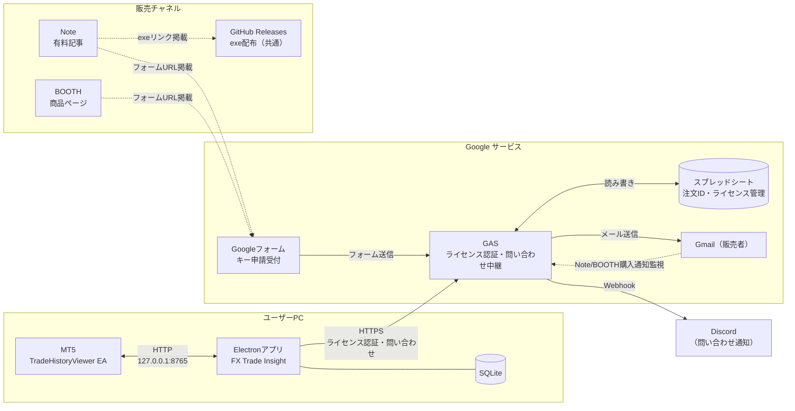

# FX Trade Insight システム構成

## 全体構成図

購入フローの詳細は「ライセンスキー発行フロー」セクションを参照。



---

## サービス一覧と役割

| サービス | 種別 | 役割 |
|---------|------|------|
| **Electronアプリ** | ユーザーPC | 製品本体。取引履歴の管理・分析・表示 |
| **SQLite** | ユーザーPC | 取引履歴・設定データのローカル保存 |
| **MT5 TradeHistoryViewer EA** | ユーザーPC | Electronアプリからデータ取得してMT5チャート上に描画 |
| **GAS** | Google | ライセンス認証サーバー兼問い合わせ中継。メール監視・キー発行・検証API・Discord Webhook転送を担当 |
| **Googleスプレッドシート** | Google | 注文IDとライセンス情報の永続化 |
| **Googleフォーム（Note用）** | Google | Note購入者からのキー申請受付。注文ID＋メールアドレスを入力 |
| **Googleフォーム（BOOTH用）** | Google | BOOTH購入者からのキー申請受付。メールアドレスのみ入力 |
| **Gmail（販売者）** | Google | Note購入通知の受信 / ライセンスキーのユーザーへの送信 |
| **Note** | 外部 | 販売プラットフォーム。有料記事内にフォームURLとGitHub ReleasesのexeリンクURL掲載 |
| **BOOTH** | 外部 | 販売プラットフォーム。DLページにフォームURLとGitHub ReleasesのURL掲載 |
| **GitHub Releases** | GitHub | BOOTH・Note両購入者向けexeファイル配布（`/releases/latest` で常に最新版） |
| **Discord** | 外部 | 問い合わせ通知の受信先。GASがWebhookで転送（URLはGASスクリプトプロパティで管理） |

> **重要**: GASを実行するGoogleアカウント = Note購入通知メールを受信するGmailアカウント である必要があります。

---

## MT5 ↔ Electronアプリ ローカル通信

MT5 EAとElectronアプリはPC内のHTTP APIで通信します。インターネット不要、外部から到達不可（127.0.0.1のみリッスン）。

```
MT5 EA (TradeHistoryViewer.mq5)         Electronアプリ (127.0.0.1:8765)
                                          ポート競合時は8766〜8865を自動探索
         GET /api/trades
         ?currency_pair=USD%2FJPY
         &from=2026-04-01T00:00:00       取引履歴をSQLiteから取得
         &to=2026-04-26T23:59:59
─────────────────────────────────────>
                                          [{"id":"...","entry_time":"...","exit_time":"...",
<─────────────────────────────────────    "entry_price":149.5,"exit_price":150.1,
                                           "buy_sell":"Buy","soneki":600,"market":"東京"}]

  チャート上に描画:
  ・エントリー/イグジット矢印
  ・損益ライン
  ・損益ラベル（クリック可）

         ラベルクリック時
         GET /api/video/find
         ?entry_time=2026-04-26T08:51:00
         &preroll=10                      エントリー時刻に対応する動画を検索
─────────────────────────────────────>
                                          {"filePath":"D:/videos/東京_20260426085100.mp4",
<─────────────────────────────────────     "startPositionSeconds":3600}

         GET /api/open-video
         ?path=D:/videos/...mp4
         &time=3600                       動画プレーヤーウィンドウを表示・再生
─────────────────────────────────────>

         ラベルクリック時（詳細ウィンドウ）
         GET /api/open-trade
         ?id=gmo_12345_67890             取引履歴詳細を別ウィンドウで表示
─────────────────────────────────────>
```

### ローカルAPIエンドポイント一覧

| エンドポイント | メソッド | 主なパラメータ | 用途 |
|--------------|---------|--------------|------|
| `/api/trades` | GET | `currency_pair`, `fx_account`, `from`, `to`, `limit`, `offset` | 通貨ペア・口座・期間でフィルタした取引履歴をJSON返却 |
| `/api/trade` | POST | `[{id, currency_pair, buy_sell, entry_time, exit_time, entry_price, exit_price, lot, soneki, fx_account, market, memo, holding_time}]` | MT5 EAからのトレードデータ保存（配列・単体どちらも対応） |
| `/api/video/find` | GET | `entry_time`, `preroll` | エントリー時刻に対応する動画ファイルを検索（クリップ優先） |
| `/api/open-video` | GET | `path`, `time`, `rewind` | 指定パス・再生位置で動画プレーヤーを起動（既存ウィンドウがあれば切り替え） |
| `/api/open-trade` | GET | `id` | MT5 EAからの取引履歴詳細ウィンドウ起動（別ウィンドウ） |
| `/api/alert` | POST | `message` | MT5 EA（PriceAlertNotifier）からの音声アラート受信 |
| `/api/health` | GET | — | ヘルスチェック（`{status, port, startedAt}`を返却） |
| `/video-file` | GET | `path` | 動画プレーヤー向けローカル動画ファイル配信（Rangeリクエスト対応） |
| `/screenshot-file` | GET | `path` | スクリーンショット画像の配信（動画保存ディレクトリ配下のみ許可） |

---

## ライセンス認証の通信

ElectronアプリとGASはHTTPS通信。起動速度への影響を避けるためバックグラウンドで非同期実行。ローカルキャッシュなし（毎回GASで検証）。

```
Electronアプリ                            GAS (https://script.google.com/...)

  【初回キー入力時】
  POST /exec
  {"action":"activate",
   "key":"FTI-XXXX-XXXX-XXXX",           スプレッドシートのライセンス管理テーブルを参照:
   "machineId":"abc123..."}              ・キーが存在するか
─────────────────────────────────────>   ・有効フラグがTRUEか
                                          ・登録台数が2台未満か → マシンIDを登録
<─────────────────────────────────────
  {"status":"OK",                          ↓ 成功
   "latestVersion":"1.0.0"}             {"status":"ERROR","code":"MACHINE_LIMIT_EXCEEDED"}
  → アプリ使用開始                        ↓ 失敗（エラーメッセージ表示）
  → latestVersion が現在バージョンより
    新しければ画面上部にアップデートバナーを表示


  【2回目以降の起動時 (バックグラウンド)】
  ホーム画面を即座に表示してから非同期で検証

  GET /exec
  ?action=verify
  &key=FTI-XXXX-XXXX-XXXX               ・キーが有効か
  &machineId=abc123...                   ・マシンIDが登録済みか
─────────────────────────────────────>
<─────────────────────────────────────
  {"status":"OK",                        {"status":"ERROR","code":"KEY_REVOKED"}
   "latestVersion":"1.0.0"}             → 即座にライセンス画面へ遷移
  → 継続使用
  → latestVersion が新しければアップデートバナー表示

                                         {"status":"ERROR","code":"MACHINE_NOT_REGISTERED"}
                                         → 自動再アクティベートを試みる（activate再送信）
                                           成功 → 継続使用
                                           失敗 → ライセンス画面へ遷移

                                         {"status":"ERROR","code":"NETWORK_ERROR"}
                                         → ブロックしない（一度認証済みのためスキップ）
```

エラーコード・キー発行フロー・スプレッドシート構成の詳細は [`docs/dev/license_system_spec.md`](./license_system_spec.md) を参照。

---

## ファイル構成（関連ファイルのみ）

```
fx-trade-insight/
├── outside_function/
│   ├── gas/
│   │   └── license_system/
│   │       └── license_server.js       # GAS本体（メール監視・ライセンスAPI・キー発行）
│   └── mt5/
│       └── TradeHistoryViewer.mq5      # MT5 EA（チャート描画・動画再生連携）
└── src/
    ├── main/
    │   ├── license/
    │   │   └── licenseManager.ts       # Electronアプリ側のライセンス管理
    │   └── server/
    │       └── api.ts                  # MT5向けローカルAPIサーバー（ポート8765）
    └── renderer/src/
        ├── pages/                      # ページコンポーネント（XxxPage命名規則）
        └── components/
            ├── header/
            │   ├── filters/            # フィルターバー群（TradeFilterPanel・StatsFilterBar・VideoFilterBar・CsvStorageBar）
            │   ├── PageHeader.tsx      # ページヘッダー共通コンポーネント
            │   └── RecorderStatusBar.tsx
            └── settings/              # 設定画面カード群（TimeSignalCard・DataManagementCard・ScheduleCard・ShortcutKeyCard）
```

---

## 実装済み主要機能一覧

### トレード管理
- 取引履歴の一覧・フィルタ・ソート・CSV取込・エクスポート
- トレード詳細（タグ・エントリー理由・メモ・動画保護フラグ）
- スクリーンショット機能（エントリー/イグジット時のスクリーンショット生成・取引詳細画面で表示）
- 動画クリップ機能（トレードに紐づくクリップ動画の生成・再生）
- MT5 EAからの取引詳細ウィンドウ起動（`/api/open-trade` 経由で別ウィンドウ表示）
- MT5 EAからのトレードデータ直接保存（`POST /api/trade`）
- トレードタグ管理（一括リネーム・削除）
- エントリー理由管理（一括リネーム・削除）

### 成績分析
- 市場別成績（東京・欧州・NY）: 勝率・損益・ペイオフレシオ・期待値など
- 期間別成績（日別・週別・月別比較）
- エントリー理由別成績（理由ごとの勝率・損益・件数）
- カレンダー成績（日ごとの損益カレンダー表示・SNS画像生成・X投稿）

### 動画管理
- 録画一覧（タグ・保護フラグ・削除・ZIP圧縮）
- 動画タグ管理（一括リネーム・削除）
- 動画プレーヤー（フルスクリーン・ショートカット・前後ナビゲーション）
- アプリ内蔵スケジュール録画（エンコーダ・CRF・fps・開始/終了時刻設定）

### 設定・その他
- テーマカラー設定（ライト/ダーク）
- 時報スケジュール機能（指定時刻に音声通知）
- データバックアップ・復元
- ログ記録（`userData/app.log`・JSONL形式）
- お問い合わせ画面（エラー自動転送・ログ添付・GAS経由でDiscord Webhookに中継）

---

## 動画録画について

動画プレーヤーで再生する動画ファイルは、以下の方法で録画できます。

### アプリ内蔵録画機能

録画・再生設定画面から録画を開始できます。スケジュール設定により自動開始・自動終了が可能です。ファイルは `年-月-日 時-分-秒-ミリ秒.mp4` 形式で保存先フォルダに保存されます。

#### 録画の仕組み（音声アーキテクチャ）

録画機能は映像・音声で異なる方式を組み合わせて実現しています。

| 対象 | 方式 | 実装箇所 |
|------|------|----------|
| 映像（画面キャプチャ） | ffmpeg（gdigrab / ddagrab） | `recorderProcess.ts` |
| マイク音声 | ffmpeg DirectShow（dshow） | `recorderProcess.ts` |
| デスクトップ音声（システム音声） | Electron `getDisplayMedia` (WASAPI ループバック) | `RecorderStatusBar.tsx` |

**デスクトップ音声に ffmpeg を使わない理由**

ffmpeg の WASAPI ループバック（`-f wasapi -loopback`）は Windows のプライバシー保護やデバイス列挙の制約により安定して動作しないケースが多い。そのため、Electron（Chromium）が提供する `navigator.mediaDevices.getDisplayMedia({ audio: true, video: true })` を使用する。これは `setDisplayMediaRequestHandler` によってダイアログなしで自動的にシステム音声ストリームを取得する。

**デスクトップ音声の録音・マージフロー**

```
[録画開始]
  レンダラー: getDisplayMedia → MediaRecorder(opus/webm) 開始
  メインプロセス: ffmpeg 起動（映像 + マイクのみ録音 → .mp4）

[録画中]
  レンダラー: 1秒ごとに音声チャンクを IPC (appendDesktopAudio) 経由で
              メインプロセスの一時ファイル (.webm) にストリーミング書き込み

[録画停止]
  レンダラー: MediaRecorder.stop() → 全チャンク書き込み完了を待機
  レンダラー: finalizeDesktopAudio(startTimeMs) をメインプロセスに通知
  メインプロセス: ffmpeg で .webm と .mp4 をバックグラウンドマージ
    - マイク音声なし: デスクトップ音声のみ .mp4 に合成
    - マイク音声あり: amix フィルターで両者をミックス
```

**予約録画時のデスクトップ音声**

予約録画はメインプロセスが自動起動するため、レンダラーに `recorder:statusChanged { type: 'started', bySchedule: true }` を送信し、レンダラーが設定を読んでデスクトップ音声キャプチャを自動開始する。停止時も同様に `stopped` イベントでレンダラーが停止・フィナライズを実行する。

**音量倍率**

- `micGain`: ffmpeg の `-af volume=X` または filter_complex の `volume=` フィルターとして適用（録画時）
- `desktopAudioGain`: マージ時の ffmpeg で `-af volume=X` として適用（録画停止後）

### Bandicam による外部録画

Bandicam で録画した動画もこのアプリで再生できることを確認済みです。

#### 対応コーデック

| コーデック | 対応 | 備考 |
|-----------|------|------|
| H.264 (MP4) | ✅ | 推奨 |
| AV1 (MP4) | ✅ | 推奨 |
| H.265 / HEVC (MP4) | ❌ | 再生エラーとなるため使用不可 |

#### Bandicam の推奨設定

アプリ内蔵録画と同じファイル名形式（`年-月-日 時-分-秒-ミリ秒.mp4`）で保存するには、以下の設定を行うこと。

**一般 → 詳細設定 → ファイルタブ → ファイル名**

| 設定項目 | 設定値 |
|---------|--------|
| ファイル名（テキスト部分） | なし（空欄） |
| 日付と時間 | 有効にする |

この設定により、録画ファイルが `年-月-日 時-分-秒-ミリ秒.mp4` 形式で保存され、MT5チャートのラベルクリックによる動画自動検索が正常に機能します。

### 動画自動検索のロジック（`src/main/videoUtils.ts`）

取引履歴からの動画再生ボタン押下時に `findVideoByEntryTime()` が呼ばれる。

**前提**
- ファイル名 `yyyy-MM-dd HH-mm-ss[-SSS].mp4` から開始時刻をパースする。それ以外の形式のファイルは無視される。
- ファイルの **mtime（OS更新日時）を録画終了時刻として扱う**。録画が終わるとファイルへの書き込みが止まり mtime が確定するため。
- **注意**: 録画ファイルを別のPCにコピーすると mtime がコピー日時にリセットされる。この場合、`エントリー時刻 <= endTime(mtime)` は成立するが `diffSeconds`（エントリー位置）が分割間隔＋バッファを大幅に超えた値になる可能性がある。

**検索手順**

1. `startTime <= エントリー時刻` のファイルを抽出し、開始時刻の新しい順に並べる
2. 先頭から順に `エントリー時刻 <= endTime(mtime)` を満たす最初のファイルを選ぶ
   - 短い録画（数秒〜数十秒）が間に挟まっている場合は自動的にスキップされ、より古い長い録画にフォールバックする
3. **位置バリデーション**: `diffSeconds > (splitInterval + VIDEO_GAP_BUFFER_MINUTES) * 60` の場合は `null` を返す
   - mtime がコピー等で変わっている場合の誤マッチを防ぐ（そのファイルに含まれるはずがない位置は無効とみなす）
4. 再生開始位置 = `(エントリー時刻 - startTime) - prerollSeconds`（秒）
5. 次ファイル = `startTime` が選択ファイルの `startTime + splitInterval + バッファ` 以内の次の録画ファイル

**設定値**

| 設定 | デフォルト | 説明 |
|---|---|---|
| `preroll_seconds` | 15秒 | エントリー時刻の何秒前から再生するか |
| `split_interval` | 120分 | 分割録画間隔。次ファイル検索の上限に使用 |
| `VIDEO_GAP_BUFFER_MINUTES` | 定数参照 | 分割間隔に加算する余裕時間 |

### メディアファイルの保存パス

スクリーンショットとクリップは `movie_storage` 配下に相対パスで保存される。

| 種別 | 保存パス | 備考 |
|------|---------|------|
| エントリースクショ | `screenshots/YYYY-MM/{tradeId}_entry.png` | entry_time の年月でサブフォルダ分け |
| イグジットスクショ | `screenshots/YYYY-MM/{tradeId}_exit.png` | entry_time の年月でサブフォルダ分け |
| クリップ | `clips/YYYY-MM/{tradeId}.mp4` | entry_time の年月でサブフォルダ分け |

- `YYYY-MM` は entry_time から `getYearMonthFromEntryTime()` で算出（`src/main/ipc/helpers.ts`）
- 旧形式の絶対パスまたはフラットな相対パスも `resolveMediaPath()` で後方互換的に解決される

---

## リポジトリ構成

ソースコードとユーザー向けドキュメントは別リポジトリで管理する。

| リポジトリ | 公開範囲 | 内容 |
|-----------|---------|------|
| `fx-trade-insight-source`（本リポジトリ） | private | ソースコード・全ドキュメント原本 |
| [`fx-trade-insight/fx-trade-insight`](https://github.com/fx-trade-insight/fx-trade-insight) | public | ユーザー向けドキュメント（`docs/user/` の内容） |
| [`fx-trade-insight/fx-trade-insight-portfolio`](https://github.com/fx-trade-insight/fx-trade-insight-portfolio) | public | ポートフォリオ（`README.md` + 選択した `docs/dev/`） |

### 自動同期（GitHub Actions）

`.github/workflows/sync-docs.yml` により、main への push 時に以下が自動反映される。

| 同期元 | 同期先リポジトリ |
|--------|----------------|
| `docs/user/**` | `fx-trade-insight/fx-trade-insight` |
| `README.md`, `docs/dev/system_architecture.md`, `docs/dev/release_guide.md` | `fx-trade-insight/fx-trade-insight-portfolio` |

> 非公開ファイル（`license_system_spec.md` 等）は同期対象外。Actions で明示的に指定したファイルのみが公開される。

---

## 関連ドキュメント

### 技術仕様
- [`docs/dev/code_signing_plan.md`](./code_signing_plan.md) — コード署名証明書の導入計画（取得手順・electron-builder への反映方法）
- [`docs/dev/goto_day_spec.md`](./goto_day_spec.md) — ゴトー日判定仕様（定義・振替ルール・31日特例・年末年始除外・2026年一覧）
- [`docs/dev/license_system_spec.md`](./license_system_spec.md) — ライセンス認証システムの詳細仕様（Note・BOOTH両対応）
- [`docs/dev/database_spec.md`](./database_spec.md) — SQLiteテーブル定義・user_settingキー一覧
- [`docs/dev/csv_format_notes.md`](./csv_format_notes.md) — 口座別CSVフォーマット仕様
- [`docs/dev/clasp_guide.md`](./clasp_guide.md) — GAS/claspの運用手順
- [`docs/dev/virtualbox_test_guide.md`](./virtualbox_test_guide.md) — VirtualBoxを使ったクリーン環境テスト手順
- [`docs/dev/release_guide.md`](./release_guide.md) — リリース・バージョンアップ手順（ブランチ戦略・ビルド・GitHub Releases・配布）

### 個人運用ツール（アプリ外）
- [`docs/personal/notification_system_redesign.md`](../personal/notification_system_redesign.md) — 個人用通知システムの構成（MT5 EA・GAS価格アラート・X速報）。アプリ本体とは独立した個人運用ツール。

### 販売・マーケティング
- [`docs/sales/sales_preparation.md`](../sales/sales_preparation.md) — 販売準備チェックリスト（Note・BOOTH）
- [`docs/sales/policies/legal_notices.md`](../sales/policies/legal_notices.md) — 特定商取引法に基づく表記 / 利用規約
- [`docs/sales/policies/privacy_policy.md`](../sales/policies/privacy_policy.md) — プライバシーポリシー
- [`docs/sales/policies/support_policy.md`](../sales/policies/support_policy.md) — サポート運用方針
- [`docs/sales/booth/listing.md`](../sales/booth/listing.md) — BOOTH商品ページ用テキスト・ダウンロードページメッセージ
- [`docs/sales/note/article_free.md`](../sales/note/article_free.md) — Note無料紹介記事
- [`docs/sales/note/article_paid.md`](../sales/note/article_paid.md) — Note有料販売記事
- [`docs/sales/email_templates.md`](../sales/email_templates.md) — メールテンプレート集（自動送信・手動送信）

### ユーザー向けドキュメント
公開リポジトリ（[fx-trade-insight/fx-trade-insight](https://github.com/fx-trade-insight/fx-trade-insight)）にも配置。

- [`docs/user/user_install_guide.md`](../user/user_install_guide.md) — インストール手順書（Note・BOOTH対応）
- [`docs/user/user_setup_guide.md`](../user/user_setup_guide.md) — 初回セットアップ手順書
- [`docs/user/user_pc_migration_guide.md`](../user/user_pc_migration_guide.md) — PC移行手順書
- [`docs/user/user_faq.md`](../user/user_faq.md) — よくある質問（FAQ）
